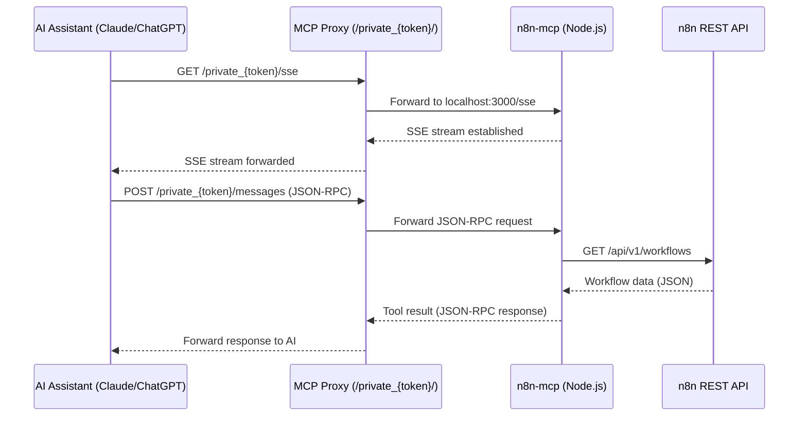

<h1 align="center">Woow n8n MCP Server</h1>

<p align="center">
  <strong>Production-ready MCP Admin Bundle for n8n Workflow Automation</strong><br/>
  Web GUI + MCP Reverse Proxy + n8n-mcp Server in a single container
</p>

<p align="center">
  <a href="#features">Features</a> &bull;
  <a href="#architecture">Architecture</a> &bull;
  <a href="#quick-start">Quick Start</a> &bull;
  <a href="#installation">Installation</a> &bull;
  <a href="#configuration">Configuration</a> &bull;
  <a href="#screenshots">Screenshots</a> &bull;
  <a href="#api-reference">API</a> &bull;
  <a href="#security">Security</a> &bull;
  <a href="README_zh-TW.md">中文文件</a>
</p>

<p align="center">
  
  
  
  
  
  
  
  
  
  
</p>

---

## Overview

**Woow n8n MCP Server** is a complete, production-ready admin bundle for managing the [n8n-mcp](https://github.com/czlonkowski/n8n-mcp) server -- the Model Context Protocol (MCP) bridge that lets AI assistants (Claude, ChatGPT, Gemini) interact with your n8n workflow automation instance.

This project packages everything you need into a single container:

- A **React-based admin dashboard** for visual configuration
- A **FastAPI backend** with JWT authentication and REST APIs
- An **MCP reverse proxy** with token-based access control
- The **n8n-mcp Node.js server** as a managed subprocess

<p align="center">
  
</p>

### Why This Bundle?

| Challenge | Solution |
|-----------|----------|
| n8n-mcp requires manual CLI configuration | Web GUI with forms for API URL, API key, and tool management |
| No built-in access control for MCP endpoints | Token-authenticated reverse proxy with rotation and history |
| Difficult to monitor MCP server health | Real-time dashboard with n8n version, workflow count, and process status |
| Tool management requires editing env vars | Visual toggle for 24 tools across 3 categories |
| No centralized logging | Real-time SSE log streaming with search |
| Complex multi-service deployment | Single container with Podman, Docker, or Kubernetes support |

### Comparison: Before vs. After

| Aspect | Without This Bundle | With This Bundle |
|--------|--------------------|--------------------|
| Configuration | Edit environment variables manually | Web GUI with validation |
| Authentication | None (open MCP endpoint) | JWT admin + token-protected proxy |
| Monitoring | Check process manually | Dashboard with health indicators |
| Tool Control | Set `DISABLED_TOOLS` env var | Visual toggle per tool |
| Token Rotation | Manual token management | One-click generation and rotation |
| Logging | Grep through container logs | Real-time streaming with search |
| Deployment | Multiple containers + nginx | Single container, one port |

---

## Features

### Dashboard

The dashboard provides an at-a-glance view of your entire MCP stack:

- **n8n Connection Status** -- Whether the n8n REST API is reachable, along with the detected n8n version
- **MCP Server Status** -- Process ID, running state, and restart count
- **MCP Proxy Status** -- Built-in reverse proxy health
- **Workflow Count** -- Total workflows on the connected n8n instance
- **Overall Health** -- Aggregated status indicator (OK / Degraded / Error)

### Connection Configuration

Configure how the MCP admin connects to your n8n instance:

- **n8n API URL** -- The base URL of your n8n instance (e.g., `http://n8n:5678`)
- **n8n API Key** -- API key for n8n REST API authentication
- **MCP Session Timeout** -- Session timeout for MCP connections (60s - 86400s)
- **MCP Max Sessions** -- Maximum concurrent MCP sessions (1-100)
- **Connectivity Test** -- One-click test that verifies the n8n REST API is reachable and returns the n8n version
- **Auto-restart** -- Optionally restart the MCP server after configuration changes

### Tool Manager

The n8n-mcp server provides **24 tools** organized into **3 categories**:

#### Core Reference (7 tools) -- Read-only documentation and node lookup

| Tool | Description |
|------|-------------|
| `tools_documentation` | Get documentation for all available n8n MCP tools |
| `search_nodes` | Search for n8n nodes by name, description, or category |
| `get_node` | Get detailed information about a specific n8n node type |
| `validate_node` | Validate a node configuration against its schema |
| `validate_workflow` | Validate workflow JSON structure without creating it |
| `search_templates` | Search n8n community workflow templates by keyword |
| `get_template` | Get a specific workflow template by ID with full details |

#### Instance Management (13 tools) -- CRUD workflows, executions, health

| Tool | Description | Operations |
|------|-------------|------------|
| `n8n_create_workflow` | Create a new workflow on the n8n instance | create |
| `n8n_get_workflow` | Get a workflow by ID with full details | read |
| `n8n_update_full_workflow` | Fully replace a workflow definition | update |
| `n8n_update_partial_workflow` | Partially update a workflow | update |
| `n8n_delete_workflow` | Delete a workflow by ID permanently | delete |
| `n8n_list_workflows` | List all workflows with filtering options | read |
| `n8n_validate_workflow` | Validate a workflow against the live instance | read |
| `n8n_autofix_workflow` | Auto-fix common workflow issues | update |
| `n8n_test_workflow` | Execute a workflow in test mode | execute |
| `n8n_executions` | List, get, or delete execution history | read, delete |
| `n8n_health_check` | Check n8n instance health and version | read |
| `n8n_workflow_versions` | List and restore workflow version history | read, update |
| `n8n_deploy_template` | Deploy a community template as a workflow | create |

#### Advanced (4 tools) -- Data tables, credentials, generation, audit

| Tool | Description | Operations |
|------|-------------|------------|
| `n8n_manage_datatable` | CRUD operations on n8n data tables | create, read, update, delete |
| `n8n_manage_credentials` | Manage n8n credentials | create, read, update, delete |
| `n8n_generate_workflow` | Generate a workflow from natural language | create |
| `n8n_audit_instance` | Run a comprehensive instance audit | read |

The Tool Manager GUI allows you to:

- Toggle individual tools on/off with a single click
- See tool counts per category (enabled vs. total)
- Identify dangerous tools marked with a warning indicator
- Disable specific operations on per-tool basis
- Auto-restart the MCP server when tool configuration changes

### Token Manager

Manage MCP proxy authentication tokens:

- **Generate** -- Create a new random hex token (32-256 characters)
- **Rotate** -- Generate, apply, and restart the proxy in one step
- **Set** -- Apply a specific token value
- **History** -- View the last 5 token rotations with timestamps and masked previous tokens
- **Masked Display** -- Current token shown with only the first and last 4 characters visible

### Log Viewer

Real-time MCP server log monitoring:

- **SSE Streaming** -- Live log updates via Server-Sent Events
- **Tail on Connect** -- Configurable number of initial log lines (1-1000)
- **Search** -- Full-text or regex search across the 5000-line in-memory buffer
- **Auto-scroll** -- Automatically scroll to the latest log entry
- **Source Filtering** -- Filter by log source (mcp-server)

### Settings

Full configuration management:

- **Config Editor** -- View and edit the complete `config.json` structure
- **Section Editor** -- Update individual config sections (connection, mcp_server, proxy, tools)
- **MCP Process Control** -- Start, stop, and restart the MCP server subprocess
- **Process Status** -- View PID, running state, restart count, and exit code
- **Admin Password** -- Change the admin login password

### MCP Proxy

Built-in token-authenticated reverse proxy:

- **URL Path Token** -- Access via `/private_{token}/sse` and `/private_{token}/messages`
- **SSE Streaming** -- Full support for MCP protocol SSE connections
- **Bearer Token Forwarding** -- Optionally forward a Bearer token to the upstream MCP server
- **Configurable Timeout** -- Up to 86400 seconds (24 hours) for long-running MCP sessions
- **Hop-by-hop Header Stripping** -- Clean header forwarding for proxied requests

---

## Architecture

```
┌─────────────────────────────────────────────────────────────────────┐
│                   Woow n8n MCP Admin Bundle                        │
│                        (Single Container)                           │
├─────────────────────────────────────────────────────────────────────┤
│                                                                     │
│  ┌───────────────────────────────────────────────────────────────┐  │
│  │              React SPA (Vite + Tailwind CSS)                  │  │
│  │                                                               │  │
│  │  Dashboard │ Connection │ Tools │ Tokens │ Logs │ Settings    │  │
│  └──────────────────────────┬────────────────────────────────────┘  │
│                             │ HTTP                                  │
│  ┌──────────────────────────▼────────────────────────────────────┐  │
│  │                  FastAPI Backend (:8080)                       │  │
│  │                                                               │  │
│  │  ┌──────────┐  ┌──────────┐  ┌──────────┐  ┌──────────────┐ │  │
│  │  │   Auth   │  │  Config  │  │  Process  │  │  MCP Proxy   │ │  │
│  │  │Middleware│  │  Store   │  │  Manager  │  │  /private_*  │ │  │
│  │  └──────────┘  └──────────┘  └──────────┘  └──────┬───────┘ │  │
│  └───────────────────────────────────────────────────│──────────┘  │
│                                                      │             │
│  ┌───────────────────────────────────────────────────▼──────────┐  │
│  │              n8n-mcp Server (Node.js subprocess)             │  │
│  │                                                               │  │
│  │  24 MCP Tools │ SSE Transport │ JSON-RPC Messages            │  │
│  └──────────────────────────┬────────────────────────────────────┘  │
│                             │                                      │
├─────────────────────────────┼──────────────────────────────────────┤
│                             ▼                                      │
│  ┌───────────────────────────────────────────────────────────────┐  │
│  │                   n8n REST API (:5678)                        │  │
│  │        Workflows │ Executions │ Credentials │ Health          │  │
│  └───────────────────────────────────────────────────────────────┘  │
└─────────────────────────────────────────────────────────────────────┘
```

### Module Dependency Graph

```
┌─────────────────────────────────────────────────────────────────┐
│  n8n_mcp_admin (n8n-specific admin)                             │
│                                                                  │
│  main.py ── create_app(extra_routers=[...])                     │
│                │                                                 │
│                ├── routers/config.py    (n8n connection)         │
│                ├── routers/tools.py     (24-tool registry)      │
│                ├── routers/tokens.py    (proxy token mgmt)      │
│                ├── routers/health.py    (dashboard data)         │
│                └── routers/logs.py      (SSE log streaming)     │
│                                                                  │
│         depends on                                               │
│                │                                                 │
│                ▼                                                 │
│  ┌──────────────────────────────────────────────────────────┐   │
│  │  mcp_admin_core (shared library)                         │   │
│  │                                                          │   │
│  │  app.py          ── FastAPI factory + SPA serving         │   │
│  │  config/store.py ── File-backed JSON config              │   │
│  │  process.py      ── asyncio subprocess manager            │   │
│  │  proxy.py        ── MCP reverse proxy                     │   │
│  │  auth/           ── JWT middleware + login                 │   │
│  │  routers/        ── Settings CRUD                         │   │
│  └──────────────────────────────────────────────────────────┘   │
│                                                                  │
│  ┌──────────────────────────────────────────────────────────┐   │
│  │  n8n-mcp (npm package, Node.js)                          │   │
│  │                                                          │   │
│  │  24 MCP tools ── n8n REST API bridge                      │   │
│  │  HTTP transport ── SSE + JSON-RPC                         │   │
│  └──────────────────────────────────────────────────────────┘   │
└─────────────────────────────────────────────────────────────────┘
```

### Data Flow: AI Assistant to n8n



---

## Quick Start

### One-liner with Podman

```bash
podman run -d \
  --name n8n-mcp-admin \
  -p 8080:8080 \
  -v ./data:/data \
  ghcr.io/woowtech/n8n-mcp-admin:latest
```

Then open http://localhost:8080 and log in with the default password `admin`.

### One-liner with Docker

```bash
docker run -d \
  --name n8n-mcp-admin \
  -p 8080:8080 \
  -v ./data:/data \
  ghcr.io/woowtech/n8n-mcp-admin:latest
```

### Full Stack with Docker Compose

Start PostgreSQL + n8n + MCP Admin Bundle:

```bash
git clone https://github.com/WOOWTECH/woow_n8n_mcp_server.git
cd woow_n8n_mcp_server
docker compose up -d
```

This starts:
- **PostgreSQL** on port 5432 (internal)
- **n8n** on port 5678
- **MCP Admin Bundle** on port 8080

---

## Installation

### Option 1: Podman (Recommended)

Build and run locally:

```bash
# Clone the repository
git clone https://github.com/WOOWTECH/woow_n8n_mcp_server.git
cd woow_n8n_mcp_server

# Build the container image
podman build -t n8n-mcp-admin .

# Run with persistent data
podman run -d \
  --name n8n-mcp-admin \
  -p 8080:8080 \
  -v ./data:/data \
  n8n-mcp-admin
```

### Option 2: Docker

```bash
# Clone and build
git clone https://github.com/WOOWTECH/woow_n8n_mcp_server.git
cd woow_n8n_mcp_server

docker build -t n8n-mcp-admin .

docker run -d \
  --name n8n-mcp-admin \
  -p 8080:8080 \
  -v ./data:/data \
  n8n-mcp-admin
```

### Option 3: Docker Compose (Full Stack)

```bash
git clone https://github.com/WOOWTECH/woow_n8n_mcp_server.git
cd woow_n8n_mcp_server

# Start all services
docker compose up -d

# View logs
docker compose logs -f mcp-admin
```

### Option 4: Kubernetes

Deploy to a K8s cluster:

```bash
# Apply the manifests
kubectl apply -f k8s-deploy.yaml

# Verify deployment
kubectl get pods -n kasim-odoo -l app=n8n-mcp-admin

# Port-forward for local access
kubectl port-forward -n kasim-odoo svc/n8n-mcp-admin-svc 9002:9002
```

The K8s manifest includes:
- RBAC (ServiceAccount, Role, RoleBinding) for namespace-scoped Secret/ConfigMap access
- Deployment with health probes (readiness + liveness)
- Resource limits (100m-500m CPU, 128Mi-512Mi RAM)
- Control-plane node selector

### Option 5: Development Mode

For local development without containers:

```bash
# Clone the repository
git clone https://github.com/WOOWTECH/woow_n8n_mcp_server.git
cd woow_n8n_mcp_server

# Install Python packages
pip install -e .
pip install n8n-mcp-admin  # or install from local n8n_pyproject.toml

# Install frontend dependencies
cd frontend && npm install && cd ..

# Install n8n-mcp globally
npm install -g n8n-mcp

# Start backend
uvicorn n8n_mcp_admin.main:app --reload --port 8080

# Start frontend (separate terminal)
cd frontend && npm run dev
```

---

## Configuration

### Initial Setup via Web GUI

After starting the container, open `http://localhost:8080` in your browser:

1. **Login** -- Enter the admin password (default: `admin`)

<p align="center">
  
</p>

2. **Connection** -- Configure your n8n API URL and API Key, then click "Test Connection"

<p align="center">
  
</p>

3. **Tools** -- Enable or disable the 24 MCP tools as needed

<p align="center">
  
</p>

4. **Tokens** -- Generate an MCP proxy token for AI assistant access

<p align="center">
  
</p>

### Configuration File

All settings are stored in `/data/config.json`:

```json
{
  "admin_password": "your-secure-password",
  "mcp_auth_token": "your-64-char-hex-token",
  "connection": {
    "n8n_api_url": "http://n8n:5678",
    "n8n_api_key": "your-n8n-api-key",
    "mcp_session_timeout": "3600",
    "mcp_max_sessions": "10"
  },
  "tools": {
    "disabled": [],
    "disabled_operations": {}
  },
  "mcp_server": {
    "command": "n8n-mcp",
    "args": ["--transport", "http", "--port", "3000"],
    "port": 3000,
    "env": {
      "N8N_API_URL": "http://n8n:5678",
      "N8N_API_KEY": "your-n8n-api-key"
    }
  },
  "proxy": {
    "timeout": 86400
  },
  "token_history": []
}
```

### Environment Variables

| Variable | Default | Description |
|----------|---------|-------------|
| `MCP_ADMIN_CONFIG` | `/data/config.json` | Path to configuration file |
| `JWT_SECRET` | (random) | JWT signing secret (auto-generated if not set) |
| `JWT_EXPIRY_HOURS` | `24` | JWT token expiration in hours |

### Connecting AI Assistants

After configuring the bundle, connect your AI assistant using the MCP proxy URL:

```
http://your-server:8080/private_{your-token}/sse
```

#### Claude Desktop Configuration

Add to your `claude_desktop_config.json`:

```json
{
  "mcpServers": {
    "n8n": {
      "url": "http://your-server:8080/private_your-token-here/sse"
    }
  }
}
```

#### Cursor / VS Code

Add to your MCP settings:

```json
{
  "n8n": {
    "url": "http://your-server:8080/private_your-token-here/sse"
  }
}
```

---

## Screenshots

### Login Page

Secure JWT-based authentication with session persistence.

<p align="center">
  
</p>

### Dashboard

Real-time health monitoring of n8n, MCP server, and proxy components.

<p align="center">
  
</p>

### Connection Configuration

Configure and test your n8n API connection with masked key display.

<p align="center">
  
</p>

### Tool Manager

Visual toggle for 24 MCP tools across 3 categories with dangerous tool indicators.

<p align="center">
  
</p>

### Token Manager

Generate, rotate, and track MCP proxy authentication tokens.

<p align="center">
  
</p>

### Log Viewer

Real-time SSE log streaming with search and auto-scroll.

<p align="center">
  
</p>

### Settings

Full configuration editor with MCP process control panel.

<p align="center">
  
</p>

---

## API Reference

### Authentication

| Method | Endpoint | Description |
|--------|----------|-------------|
| `POST` | `/api/auth/login` | Authenticate with admin password, returns JWT |

### Dashboard

| Method | Endpoint | Description |
|--------|----------|-------------|
| `GET` | `/api/health` | Dashboard health data (n8n, MCP, proxy status) |

### Connection

| Method | Endpoint | Description |
|--------|----------|-------------|
| `GET` | `/api/config` | Current n8n connection settings (masked) |
| `PUT` | `/api/config/connection` | Update n8n API URL, API key, session settings |
| `POST` | `/api/config/test` | Test n8n REST API connectivity |

### Tools

| Method | Endpoint | Description |
|--------|----------|-------------|
| `GET` | `/api/tools` | List all 24 tools with categories and enabled status |
| `PUT` | `/api/tools` | Update disabled tools list |
| `PUT` | `/api/tools/operations` | Update disabled tool operations |

### Tokens

| Method | Endpoint | Description |
|--------|----------|-------------|
| `GET` | `/api/tokens` | Current token (masked) + rotation history |
| `POST` | `/api/tokens/generate` | Generate a new random token (preview only) |
| `POST` | `/api/tokens/rotate` | Generate + apply + restart proxy |
| `PUT` | `/api/tokens` | Set a specific token value |

### Logs

| Method | Endpoint | Description |
|--------|----------|-------------|
| `GET` | `/api/logs/stream` | SSE log streaming with configurable tail |
| `GET` | `/api/logs/search` | Search in-memory log buffer (text or regex) |

### Settings

| Method | Endpoint | Description |
|--------|----------|-------------|
| `GET` | `/api/settings` | Full config (passwords masked) |
| `PUT` | `/api/settings` | Replace full config |
| `GET` | `/api/settings/{section}` | Get one config section |
| `PUT` | `/api/settings/{section}` | Replace one config section |
| `GET` | `/api/settings/mcp/status` | MCP server process status |
| `POST` | `/api/settings/mcp/restart` | Restart MCP server process |

### System

| Method | Endpoint | Description |
|--------|----------|-------------|
| `GET` | `/healthz` | Kubernetes-compatible health check |

---

## Security

### Authentication Model

The bundle implements a two-layer authentication model:

```
┌─────────────────────────────────────────────────────┐
│                Authentication Layers                 │
│                                                     │
│  Layer 1: Admin GUI (JWT)                           │
│  ┌─────────────────────────────────────────────┐    │
│  │  POST /api/auth/login                       │    │
│  │    → password → JWT token (HS256, 24h)      │    │
│  │    → stored in httpOnly cookie              │    │
│  │                                             │    │
│  │  All /api/* routes require valid JWT        │    │
│  │  Except: /api/auth/login, /healthz          │    │
│  └─────────────────────────────────────────────┘    │
│                                                     │
│  Layer 2: MCP Proxy (URL Path Token)                │
│  ┌─────────────────────────────────────────────┐    │
│  │  /private_{token}/sse                       │    │
│  │  /private_{token}/messages                  │    │
│  │                                             │    │
│  │  Token validated against config store       │    │
│  │  Invalid/missing token → 403 Forbidden      │    │
│  └─────────────────────────────────────────────┘    │
│                                                     │
│  MCP Server: Not directly exposed                   │
│  Only accessible via authenticated proxy            │
└─────────────────────────────────────────────────────┘
```

### Security Features

- **JWT Authentication** -- Admin GUI protected by HS256 JWT tokens with configurable expiration
- **httpOnly Cookies** -- JWT tokens stored in secure httpOnly cookies (SameSite=Strict)
- **Password Comparison** -- Admin password compared with constant-time comparison (`secrets.compare_digest`)
- **Token Masking** -- API keys and tokens always displayed masked (first 4 + last 4 characters)
- **MCP Proxy Isolation** -- The n8n-mcp server is only accessible through the token-authenticated reverse proxy
- **CORS Configuration** -- Configurable CORS origins (defaults to `*` for development)
- **Hop-by-hop Header Stripping** -- Proxy strips connection-related headers before forwarding
- **No Direct Node.js Exposure** -- The n8n-mcp process listens only on localhost

### Security Best Practices

1. **Change the default admin password** immediately after first login
2. **Set `JWT_SECRET`** environment variable in production (auto-generated tokens do not persist across restarts)
3. **Generate a strong MCP token** (64+ hex characters) and share only with authorized AI assistants
4. **Use HTTPS** in production via a reverse proxy (nginx, Cloudflare Tunnel, etc.)
5. **Restrict network access** to port 8080 using firewall rules or Kubernetes NetworkPolicy

---

## Testing

### Test Summary

| Test Area | Tests | Passed | Rate |
|-----------|-------|--------|------|
| Config Store (CRUD) | 4 | 4 | 100% |
| Process Manager (lifecycle) | 3 | 3 | 100% |
| Auth Middleware (JWT) | 3 | 3 | 100% |
| Connection Router | 2 | 2 | 100% |
| Tool Router (24 tools) | 2 | 2 | 100% |
| Token Router | 2 | 2 | 100% |
| Log Router (SSE + search) | 1 | 1 | 100% |
| Settings Router | 1 | 1 | 100% |
| MCP Proxy | 1 | 1 | 100% |
| **Total** | **19** | **19** | **100%** |

### Running Tests

```bash
# Backend tests
pip install -e ".[dev]"
pytest -v

# Frontend tests (if applicable)
cd frontend && npm test
```

---

## Changelog

### v1.0.0 (2026-06)

- **Initial Release** -- Full n8n MCP Admin Bundle
- **Dashboard** -- Real-time health monitoring with n8n version detection and workflow count
- **Connection Configuration** -- n8n API URL + API Key management with one-click connectivity testing
- **Tool Manager** -- Visual toggle for 24 MCP tools across 3 categories (Core Reference, Instance Management, Advanced)
- **Token Manager** -- MCP proxy token generation, rotation, and history tracking
- **Log Viewer** -- Real-time SSE streaming with in-memory ring buffer and search (text + regex)
- **Settings** -- Full `config.json` CRUD with MCP process control (start/stop/restart)
- **MCP Proxy** -- Token-authenticated reverse proxy with SSE streaming support
- **Auth** -- JWT-based admin authentication with httpOnly cookies
- **Docker** -- Multi-stage Dockerfile with Node.js 20 + Python 3.12
- **Docker Compose** -- Full stack configuration (PostgreSQL + n8n + MCP Admin)
- **Kubernetes** -- Production deployment manifests with RBAC, health probes, and resource limits
- **Testing** -- 19/19 backend tests passing

---

## Tech Stack

| Component | Technology | Version |
|-----------|-----------|---------|
| Frontend | React + Tailwind CSS + Vite | React 19, Tailwind 3.4, Vite 6 |
| Backend | FastAPI + Uvicorn | FastAPI 0.115+, Python 3.12 |
| MCP Server | n8n-mcp (Node.js) | v2.60.0, Node.js 20 |
| Automation | n8n | 2.60+ |
| Authentication | PyJWT | 2.9+ |
| HTTP Client | httpx | Latest |
| Container | Podman / Docker | Multi-stage build |
| Orchestration | Kubernetes / K3s | v1.31+ |
| Protocol | MCP (Model Context Protocol) | SSE + JSON-RPC |

---

## Project Structure

```
woow_n8n_mcp_server/
├── mcp_admin_core/              # Shared core library
│   ├── __init__.py
│   ├── app.py                   # FastAPI app factory
│   ├── process.py               # MCP subprocess manager
│   ├── proxy.py                 # MCP reverse proxy
│   ├── mcp_sse_wrapper.py       # SSE protocol wrapper
│   ├── auth/
│   │   ├── __init__.py
│   │   └── middleware.py        # JWT auth middleware + login router
│   ├── config/
│   │   ├── __init__.py
│   │   └── store.py             # File-backed config store
│   ├── k8s/
│   │   ├── __init__.py
│   │   └── client.py            # K8s API client (optional)
│   └── routers/
│       ├── __init__.py
│       └── settings.py          # Settings CRUD router
│
├── n8n_mcp_admin/               # n8n-specific admin package
│   ├── __init__.py
│   ├── main.py                  # FastAPI entry point
│   ├── tool_registry.py         # 24-tool registry with categories
│   └── routers/
│       ├── __init__.py
│       ├── config.py            # n8n connection config
│       ├── health.py            # Dashboard health data
│       ├── logs.py              # SSE log streaming
│       ├── tokens.py            # Proxy token management
│       └── tools.py             # Tool enable/disable
│
├── frontend/                    # React SPA
│   ├── index.html
│   ├── package.json
│   ├── vite.config.js
│   └── src/
│       ├── main.jsx
│       ├── App.jsx
│       ├── api.js
│       ├── index.css
│       ├── components/
│       │   ├── Sidebar.jsx
│       │   └── StatusCard.jsx
│       └── pages/
│           ├── LoginPage.jsx
│           ├── Dashboard.jsx
│           ├── ConnectionConfig.jsx
│           ├── ToolManager.jsx
│           ├── TokenManager.jsx
│           ├── LogViewer.jsx
│           ├── SettingsPage.jsx
│           └── PermissionEditor.jsx
│
├── docs/
│   ├── architecture.md          # Architecture documentation
│   └── screenshots/             # 7 GUI screenshots
│       ├── dashboard.png
│       ├── connection.png
│       ├── tools.png
│       ├── tokens.png
│       ├── logs.png
│       ├── settings.png
│       └── login.png
│
├── Dockerfile                   # Multi-stage container build
├── docker-compose.yml           # Full stack (PostgreSQL + n8n + Admin)
├── k8s-deploy.yaml              # Kubernetes deployment manifests
├── pyproject.toml               # Core Python package config
├── n8n_pyproject.toml           # n8n admin Python package config
├── LICENSE                      # MIT License
├── CONTRIBUTING.md              # Contribution guide
├── README.md                    # English documentation
└── README_zh-TW.md              # Traditional Chinese documentation
```

---

## Support

- **Issues:** [GitHub Issues](https://github.com/WOOWTECH/woow_n8n_mcp_server/issues)
- **Email:** service@woowtech.io

---

## License

This project is licensed under the **MIT License**. See [LICENSE](LICENSE) for details.

---

<p align="center">
  <sub>Built by <a href="https://github.com/WOOWTECH">WOOWTECH</a> &bull; Powered by n8n + MCP Protocol</sub>
</p>
