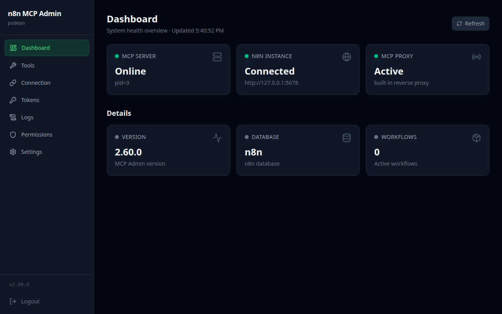
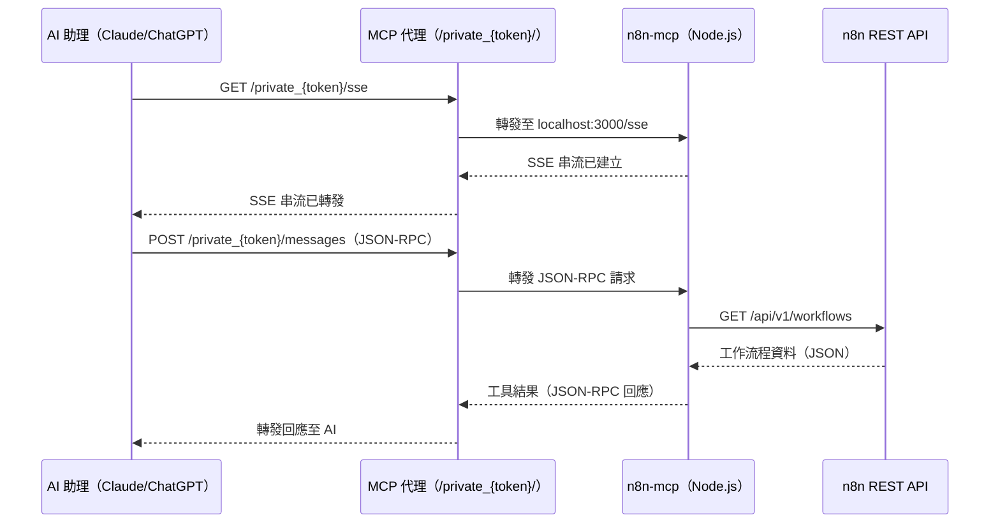
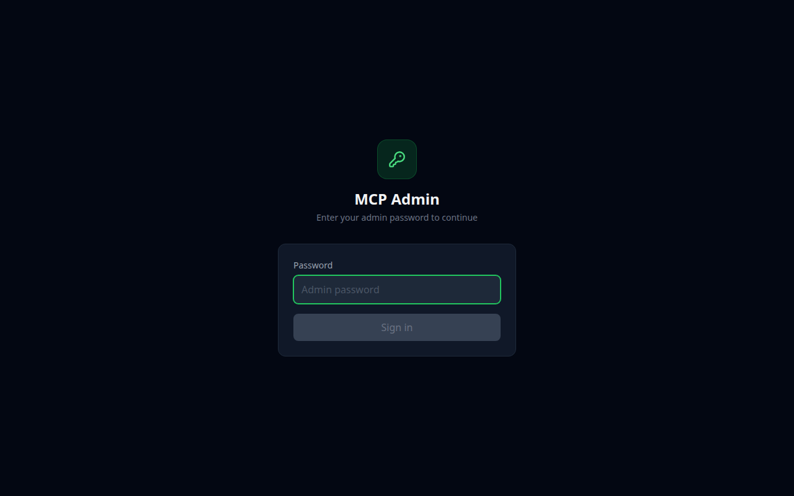
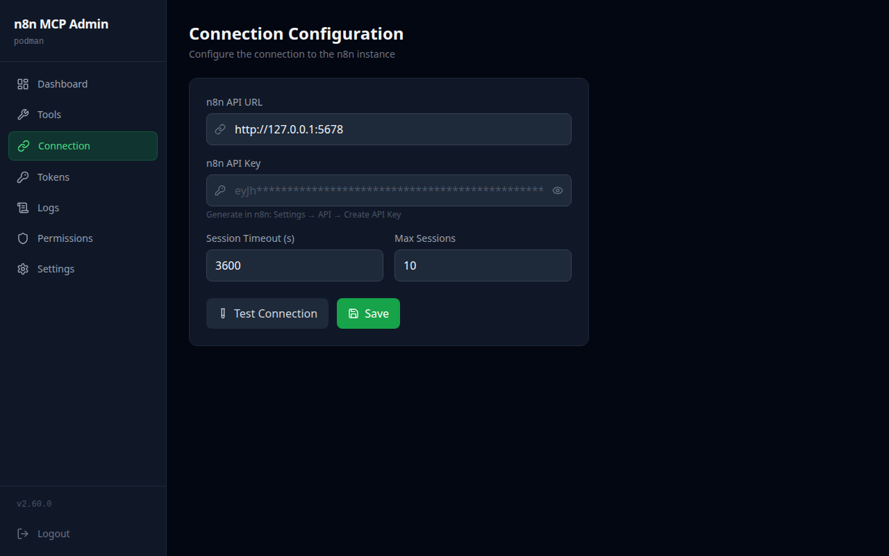
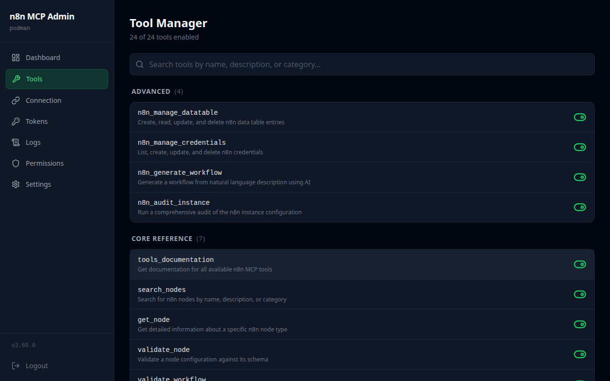
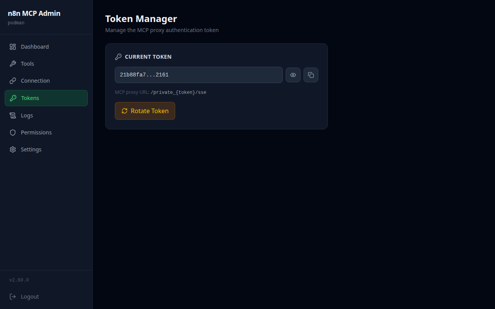
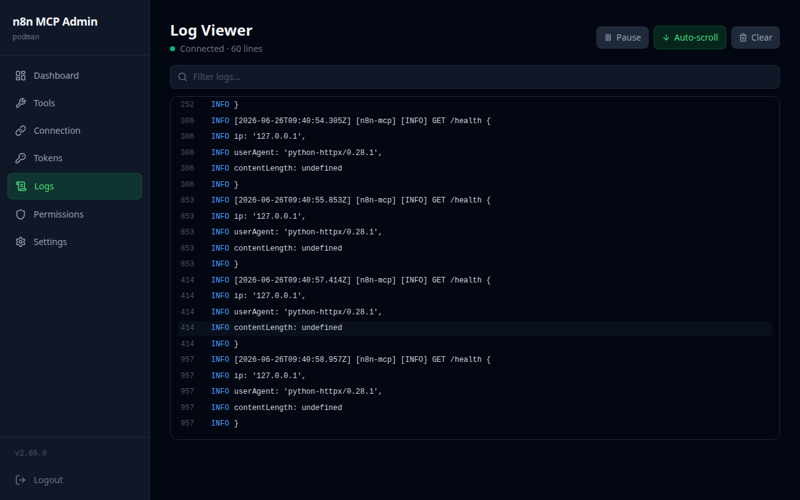
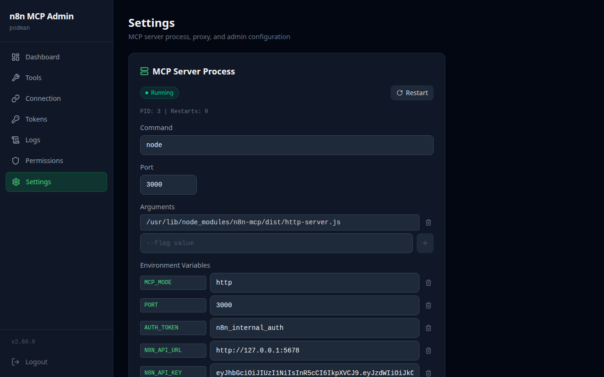

<h1 align="center">Woow n8n MCP Server</h1>

<p align="center">
  <strong>適用於 n8n 工作流程自動化的正式版 MCP 管理套件</strong><br/>
  Web 管理介面 + MCP 反向代理 + n8n-mcp 伺服器，全部整合於單一容器
</p>

<p align="center">
  <a href="#功能特色">功能特色</a> &bull;
  <a href="#系統架構">系統架構</a> &bull;
  <a href="#快速開始">快速開始</a> &bull;
  <a href="#安裝方式">安裝方式</a> &bull;
  <a href="#設定說明">設定說明</a> &bull;
  <a href="#畫面截圖">畫面截圖</a> &bull;
  <a href="#api-參考">API</a> &bull;
  <a href="#安全性">安全性</a> &bull;
  <a href="README.md">English</a>
</p>

<p align="center">
  
  
  
  
  
  
  
  
  
  
</p>

---

## 概述

**Woow n8n MCP Server** 是一套完整的正式版管理套件，用於管理 [n8n-mcp](https://github.com/czlonkowski/n8n-mcp) 伺服器 -- 這是一個 Model Context Protocol (MCP) 橋接器，讓 AI 助理（Claude、ChatGPT、Gemini）能夠與您的 n8n 工作流程自動化實例進行互動。

本專案將所有必要元件打包至單一容器中：

- **React 管理儀表板** -- 視覺化設定介面
- **FastAPI 後端** -- 含 JWT 驗證與 REST API
- **MCP 反向代理** -- 基於 Token 的存取控制
- **n8n-mcp Node.js 伺服器** -- 作為受管理的子程序執行

<p align="center">
  
</p>

### 為什麼需要這個套件？

| 挑戰 | 解決方案 |
|------|---------|
| n8n-mcp 需要手動 CLI 設定 | 提供 Web 介面，包含 API URL、API Key 及工具管理表單 |
| MCP 端點缺乏內建存取控制 | 支援 Token 驗證的反向代理，具備輪換與歷史記錄功能 |
| 難以監控 MCP 伺服器健康狀態 | 即時儀表板，顯示 n8n 版本、工作流程數量及程序狀態 |
| 工具管理需要編輯環境變數 | 提供 3 個分類、24 個工具的視覺化切換 |
| 缺乏集中式日誌管理 | 即時 SSE 日誌串流搭配搜尋功能 |
| 多服務部署過於複雜 | 單一容器，支援 Podman、Docker 或 Kubernetes |

### 使用前後對比

| 面向 | 未使用本套件 | 使用本套件 |
|------|------------|-----------|
| 設定 | 手動編輯環境變數 | Web 介面搭配驗證 |
| 驗證 | 無（開放的 MCP 端點） | JWT 管理員驗證 + Token 保護的代理 |
| 監控 | 手動檢查程序 | 含健康狀態指示器的儀表板 |
| 工具控制 | 設定 `DISABLED_TOOLS` 環境變數 | 逐個工具的視覺化切換 |
| Token 輪換 | 手動管理 Token | 一鍵產生與輪換 |
| 日誌 | 搜尋容器日誌 | 即時串流搭配搜尋 |
| 部署 | 多個容器 + nginx | 單一容器，單一連接埠 |

---

## 功能特色

### 儀表板

儀表板提供整個 MCP 堆疊的即時概覽：

- **n8n 連線狀態** -- n8n REST API 是否可連線，以及偵測到的 n8n 版本
- **MCP 伺服器狀態** -- 程序 ID、執行狀態及重啟次數
- **MCP 代理狀態** -- 內建反向代理的健康狀態
- **工作流程數量** -- 已連線 n8n 實例上的工作流程總數
- **整體健康狀態** -- 匯總狀態指標（正常 / 降級 / 錯誤）

### 連線設定

設定 MCP 管理介面如何連接到您的 n8n 實例：

- **n8n API URL** -- n8n 實例的基礎 URL（例如 `http://n8n:5678`）
- **n8n API Key** -- 用於 n8n REST API 驗證的 API 金鑰
- **MCP 工作階段逾時** -- MCP 連線的工作階段逾時（60 秒 - 86400 秒）
- **MCP 最大工作階段數** -- 最大同時 MCP 工作階段數（1-100）
- **連線測試** -- 一鍵測試，驗證 n8n REST API 是否可連線並回傳 n8n 版本
- **自動重啟** -- 設定變更後可選擇自動重啟 MCP 伺服器

### 工具管理器

n8n-mcp 伺服器提供 **24 個工具**，分為 **3 個類別**：

#### 核心參考（7 個工具）-- 唯讀文件與節點查詢

| 工具 | 說明 |
|------|------|
| `tools_documentation` | 取得所有可用 n8n MCP 工具的文件 |
| `search_nodes` | 依名稱、描述或類別搜尋 n8n 節點 |
| `get_node` | 取得特定 n8n 節點類型的詳細資訊 |
| `validate_node` | 依據結構驗證節點設定 |
| `validate_workflow` | 在不建立的情況下驗證工作流程 JSON 結構 |
| `search_templates` | 依關鍵字搜尋 n8n 社群工作流程範本 |
| `get_template` | 依 ID 取得特定工作流程範本的完整詳情 |

#### 實例管理（13 個工具）-- 工作流程 CRUD、執行記錄、健康檢查

| 工具 | 說明 | 操作 |
|------|------|------|
| `n8n_create_workflow` | 在 n8n 實例上建立新的工作流程 | 建立 |
| `n8n_get_workflow` | 依 ID 取得含完整詳情的工作流程 | 讀取 |
| `n8n_update_full_workflow` | 完整取代工作流程定義 | 更新 |
| `n8n_update_partial_workflow` | 部分更新工作流程 | 更新 |
| `n8n_delete_workflow` | 依 ID 永久刪除工作流程 | 刪除 |
| `n8n_list_workflows` | 列出所有工作流程，含篩選選項 | 讀取 |
| `n8n_validate_workflow` | 依據即時實例驗證工作流程 | 讀取 |
| `n8n_autofix_workflow` | 自動修正常見的工作流程問題 | 更新 |
| `n8n_test_workflow` | 以測試模式執行工作流程 | 執行 |
| `n8n_executions` | 列出、取得或刪除執行歷史 | 讀取、刪除 |
| `n8n_health_check` | 檢查 n8n 實例健康狀態與版本 | 讀取 |
| `n8n_workflow_versions` | 列出與還原工作流程版本歷史 | 讀取、更新 |
| `n8n_deploy_template` | 將社群範本部署為工作流程 | 建立 |

#### 進階（4 個工具）-- 資料表、憑證、產生、稽核

| 工具 | 說明 | 操作 |
|------|------|------|
| `n8n_manage_datatable` | n8n 資料表的 CRUD 操作 | 建立、讀取、更新、刪除 |
| `n8n_manage_credentials` | 管理 n8n 憑證 | 建立、讀取、更新、刪除 |
| `n8n_generate_workflow` | 從自然語言描述產生工作流程 | 建立 |
| `n8n_audit_instance` | 執行全面的實例稽核 | 讀取 |

工具管理器介面讓您可以：

- 單鍵切換個別工具的啟用/停用
- 查看各類別的工具數量（已啟用 vs. 總數）
- 識別標有警告指標的危險工具
- 依工具停用特定操作
- 工具設定變更時自動重啟 MCP 伺服器

### Token 管理器

管理 MCP 代理驗證 Token：

- **產生** -- 建立新的隨機十六進位 Token（32-256 字元）
- **輪換** -- 一步完成產生、套用並重啟代理
- **設定** -- 套用特定的 Token 值
- **歷史** -- 檢視最近 5 次 Token 輪換，含時間戳記與遮蔽的前一個 Token
- **遮蔽顯示** -- 目前的 Token 僅顯示前 4 個及後 4 個字元

### 日誌檢視器

即時 MCP 伺服器日誌監控：

- **SSE 串流** -- 透過 Server-Sent Events 即時更新日誌
- **連線時尾部載入** -- 可設定初始日誌行數（1-1000）
- **搜尋** -- 在 5000 行記憶體內緩衝區中進行全文或正則表達式搜尋
- **自動捲動** -- 自動捲動至最新的日誌項目
- **來源篩選** -- 依日誌來源篩選（mcp-server）

### 設定

完整的設定管理：

- **設定編輯器** -- 檢視與編輯完整的 `config.json` 結構
- **區段編輯器** -- 更新個別設定區段（connection、mcp_server、proxy、tools）
- **MCP 程序控制** -- 啟動、停止及重啟 MCP 伺服器子程序
- **程序狀態** -- 檢視 PID、執行狀態、重啟次數及退出碼
- **管理員密碼** -- 變更管理員登入密碼

### MCP 代理

內建的 Token 驗證反向代理：

- **URL 路徑 Token** -- 透過 `/private_{token}/sse` 和 `/private_{token}/messages` 存取
- **SSE 串流** -- 完整支援 MCP 協定的 SSE 連線
- **Bearer Token 轉發** -- 可選擇將 Bearer Token 轉發至上游 MCP 伺服器
- **可設定逾時** -- 最長 86400 秒（24 小時），適用於長時間執行的 MCP 工作階段
- **逐跳標頭剝離** -- 為代理請求進行乾淨的標頭轉發

---

## 系統架構

```
┌─────────────────────────────────────────────────────────────────────┐
│                   Woow n8n MCP 管理套件                              │
│                       （單一容器）                                    │
├─────────────────────────────────────────────────────────────────────┤
│                                                                     │
│  ┌───────────────────────────────────────────────────────────────┐  │
│  │              React SPA（Vite + Tailwind CSS）                  │  │
│  │                                                               │  │
│  │  儀表板 │ 連線設定 │ 工具 │ Token │ 日誌 │ 設定               │  │
│  └──────────────────────────┬────────────────────────────────────┘  │
│                             │ HTTP                                  │
│  ┌──────────────────────────▼────────────────────────────────────┐  │
│  │                  FastAPI 後端（:8080）                          │  │
│  │                                                               │  │
│  │  ┌──────────┐  ┌──────────┐  ┌──────────┐  ┌──────────────┐ │  │
│  │  │   驗證   │  │   設定   │  │  程序    │  │  MCP 代理    │ │  │
│  │  │  中介層  │  │   儲存   │  │  管理器  │  │  /private_*  │ │  │
│  │  └──────────┘  └──────────┘  └──────────┘  └──────┬───────┘ │  │
│  └───────────────────────────────────────────────────│──────────┘  │
│                                                      │             │
│  ┌───────────────────────────────────────────────────▼──────────┐  │
│  │              n8n-mcp 伺服器（Node.js 子程序）                  │  │
│  │                                                               │  │
│  │  24 個 MCP 工具 │ SSE 傳輸 │ JSON-RPC 訊息                   │  │
│  └──────────────────────────┬────────────────────────────────────┘  │
│                             │                                      │
├─────────────────────────────┼──────────────────────────────────────┤
│                             ▼                                      │
│  ┌───────────────────────────────────────────────────────────────┐  │
│  │                   n8n REST API（:5678）                        │  │
│  │       工作流程 │ 執行記錄 │ 憑證 │ 健康檢查                    │  │
│  └───────────────────────────────────────────────────────────────┘  │
└─────────────────────────────────────────────────────────────────────┘
```

### 資料流程：AI 助理到 n8n



---

## 快速開始

### 使用 Podman 一行指令

```bash
podman run -d \
  --name n8n-mcp-admin \
  -p 8080:8080 \
  -v ./data:/data \
  ghcr.io/woowtech/n8n-mcp-admin:latest
```

然後開啟 http://localhost:8080，使用預設密碼 `admin` 登入。

### 使用 Docker 一行指令

```bash
docker run -d \
  --name n8n-mcp-admin \
  -p 8080:8080 \
  -v ./data:/data \
  ghcr.io/woowtech/n8n-mcp-admin:latest
```

### 使用 Docker Compose 完整堆疊

啟動 PostgreSQL + n8n + MCP 管理套件：

```bash
git clone https://github.com/WOOWTECH/woow_n8n_mcp_server.git
cd woow_n8n_mcp_server
docker compose up -d
```

此命令將啟動：
- **PostgreSQL** 於連接埠 5432（內部）
- **n8n** 於連接埠 5678
- **MCP 管理套件** 於連接埠 8080

---

## 安裝方式

### 方式一：Podman（建議）

本機建置並執行：

```bash
# 複製儲存庫
git clone https://github.com/WOOWTECH/woow_n8n_mcp_server.git
cd woow_n8n_mcp_server

# 建置容器映像
podman build -t n8n-mcp-admin .

# 以持久化資料執行
podman run -d \
  --name n8n-mcp-admin \
  -p 8080:8080 \
  -v ./data:/data \
  n8n-mcp-admin
```

### 方式二：Docker

```bash
# 複製並建置
git clone https://github.com/WOOWTECH/woow_n8n_mcp_server.git
cd woow_n8n_mcp_server

docker build -t n8n-mcp-admin .

docker run -d \
  --name n8n-mcp-admin \
  -p 8080:8080 \
  -v ./data:/data \
  n8n-mcp-admin
```

### 方式三：Docker Compose（完整堆疊）

```bash
git clone https://github.com/WOOWTECH/woow_n8n_mcp_server.git
cd woow_n8n_mcp_server

# 啟動所有服務
docker compose up -d

# 檢視日誌
docker compose logs -f mcp-admin
```

### 方式四：Kubernetes

部署至 K8s 叢集：

```bash
# 套用資源清單
kubectl apply -f k8s-deploy.yaml

# 驗證部署
kubectl get pods -n kasim-odoo -l app=n8n-mcp-admin

# 連接埠轉發用於本機存取
kubectl port-forward -n kasim-odoo svc/n8n-mcp-admin-svc 9002:9002
```

K8s 資源清單包含：
- RBAC（ServiceAccount、Role、RoleBinding）用於命名空間範圍的 Secret/ConfigMap 存取
- 含健康探測（就緒 + 存活）的 Deployment
- 資源限制（100m-500m CPU、128Mi-512Mi RAM）
- 控制平面節點選擇器

### 方式五：開發模式

無需容器的本機開發：

```bash
# 複製儲存庫
git clone https://github.com/WOOWTECH/woow_n8n_mcp_server.git
cd woow_n8n_mcp_server

# 安裝 Python 套件
pip install -e .
pip install n8n-mcp-admin

# 安裝前端相依套件
cd frontend && npm install && cd ..

# 全域安裝 n8n-mcp
npm install -g n8n-mcp

# 啟動後端
uvicorn n8n_mcp_admin.main:app --reload --port 8080

# 啟動前端（另一個終端機）
cd frontend && npm run dev
```

---

## 設定說明

### 透過 Web 介面初始設定

啟動容器後，在瀏覽器開啟 `http://localhost:8080`：

1. **登入** -- 輸入管理員密碼（預設：`admin`）

<p align="center">
  
</p>

2. **連線設定** -- 設定您的 n8n API URL 和 API Key，然後點擊「測試連線」

<p align="center">
  
</p>

3. **工具管理** -- 依需求啟用或停用 24 個 MCP 工具

<p align="center">
  
</p>

4. **Token 管理** -- 產生 MCP 代理 Token 供 AI 助理存取

<p align="center">
  
</p>

### 設定檔

所有設定儲存於 `/data/config.json`：

```json
{
  "admin_password": "your-secure-password",
  "mcp_auth_token": "your-64-char-hex-token",
  "connection": {
    "n8n_api_url": "http://n8n:5678",
    "n8n_api_key": "your-n8n-api-key",
    "mcp_session_timeout": "3600",
    "mcp_max_sessions": "10"
  },
  "tools": {
    "disabled": [],
    "disabled_operations": {}
  },
  "mcp_server": {
    "command": "n8n-mcp",
    "args": ["--transport", "http", "--port", "3000"],
    "port": 3000,
    "env": {
      "N8N_API_URL": "http://n8n:5678",
      "N8N_API_KEY": "your-n8n-api-key"
    }
  },
  "proxy": {
    "timeout": 86400
  },
  "token_history": []
}
```

### 環境變數

| 變數 | 預設值 | 說明 |
|------|-------|------|
| `MCP_ADMIN_CONFIG` | `/data/config.json` | 設定檔路徑 |
| `JWT_SECRET` | （隨機） | JWT 簽章密鑰（未設定時自動產生） |
| `JWT_EXPIRY_HOURS` | `24` | JWT Token 過期時間（小時） |

### 連接 AI 助理

設定完成後，使用 MCP 代理 URL 連接您的 AI 助理：

```
http://your-server:8080/private_{your-token}/sse
```

#### Claude Desktop 設定

加入 `claude_desktop_config.json`：

```json
{
  "mcpServers": {
    "n8n": {
      "url": "http://your-server:8080/private_your-token-here/sse"
    }
  }
}
```

#### Cursor / VS Code

加入 MCP 設定：

```json
{
  "n8n": {
    "url": "http://your-server:8080/private_your-token-here/sse"
  }
}
```

---

## 畫面截圖

### 登入頁面

安全的 JWT 驗證，支援工作階段持久化。

<p align="center">
  
</p>

### 儀表板

n8n、MCP 伺服器及代理元件的即時健康監控。

<p align="center">
  
</p>

### 連線設定

設定並測試您的 n8n API 連線，金鑰以遮蔽方式顯示。

<p align="center">
  
</p>

### 工具管理器

跨 3 個類別的 24 個 MCP 工具視覺化切換，含危險工具指標。

<p align="center">
  
</p>

### Token 管理器

產生、輪換及追蹤 MCP 代理驗證 Token。

<p align="center">
  
</p>

### 日誌檢視器

即時 SSE 日誌串流，搭配搜尋與自動捲動。

<p align="center">
  
</p>

### 設定

完整的設定編輯器，搭配 MCP 程序控制面板。

<p align="center">
  
</p>

---

## API 參考

### 驗證

| 方法 | 端點 | 說明 |
|------|------|------|
| `POST` | `/api/auth/login` | 使用管理員密碼驗證，回傳 JWT |

### 儀表板

| 方法 | 端點 | 說明 |
|------|------|------|
| `GET` | `/api/health` | 儀表板健康資料（n8n、MCP、代理狀態） |

### 連線設定

| 方法 | 端點 | 說明 |
|------|------|------|
| `GET` | `/api/config` | 目前的 n8n 連線設定（已遮蔽） |
| `PUT` | `/api/config/connection` | 更新 n8n API URL、API Key、工作階段設定 |
| `POST` | `/api/config/test` | 測試 n8n REST API 連線 |

### 工具管理

| 方法 | 端點 | 說明 |
|------|------|------|
| `GET` | `/api/tools` | 列出所有 24 個工具，含類別及啟用狀態 |
| `PUT` | `/api/tools` | 更新停用工具清單 |
| `PUT` | `/api/tools/operations` | 更新停用的工具操作 |

### Token 管理

| 方法 | 端點 | 說明 |
|------|------|------|
| `GET` | `/api/tokens` | 目前的 Token（已遮蔽）+ 輪換歷史 |
| `POST` | `/api/tokens/generate` | 產生新的隨機 Token（僅預覽） |
| `POST` | `/api/tokens/rotate` | 產生 + 套用 + 重啟代理 |
| `PUT` | `/api/tokens` | 設定特定的 Token 值 |

### 日誌

| 方法 | 端點 | 說明 |
|------|------|------|
| `GET` | `/api/logs/stream` | SSE 日誌串流，可設定尾部行數 |
| `GET` | `/api/logs/search` | 搜尋記憶體內日誌緩衝區（文字或正則表達式） |

### 設定

| 方法 | 端點 | 說明 |
|------|------|------|
| `GET` | `/api/settings` | 完整設定（密碼已遮蔽） |
| `PUT` | `/api/settings` | 取代完整設定 |
| `GET` | `/api/settings/{section}` | 取得單一設定區段 |
| `PUT` | `/api/settings/{section}` | 取代單一設定區段 |
| `GET` | `/api/settings/mcp/status` | MCP 伺服器程序狀態 |
| `POST` | `/api/settings/mcp/restart` | 重啟 MCP 伺服器程序 |

### 系統

| 方法 | 端點 | 說明 |
|------|------|------|
| `GET` | `/healthz` | 相容 Kubernetes 的健康檢查 |

---

## 安全性

### 驗證模型

本套件實作兩層驗證模型：

```
┌─────────────────────────────────────────────────────┐
│                   驗證層                              │
│                                                     │
│  第一層：管理介面（JWT）                               │
│  ┌─────────────────────────────────────────────┐    │
│  │  POST /api/auth/login                       │    │
│  │    → 密碼 → JWT Token（HS256，24 小時）       │    │
│  │    → 儲存於 httpOnly Cookie                  │    │
│  │                                             │    │
│  │  所有 /api/* 路由需要有效的 JWT               │    │
│  │  例外：/api/auth/login、/healthz             │    │
│  └─────────────────────────────────────────────┘    │
│                                                     │
│  第二層：MCP 代理（URL 路徑 Token）                    │
│  ┌─────────────────────────────────────────────┐    │
│  │  /private_{token}/sse                       │    │
│  │  /private_{token}/messages                  │    │
│  │                                             │    │
│  │  Token 與設定儲存中的值進行驗證                 │    │
│  │  無效/缺少 Token → 403 禁止存取               │    │
│  └─────────────────────────────────────────────┘    │
│                                                     │
│  MCP 伺服器：不直接暴露                              │
│  僅可透過已驗證的代理存取                             │
└─────────────────────────────────────────────────────┘
```

### 安全功能

- **JWT 驗證** -- 管理介面受 HS256 JWT Token 保護，過期時間可設定
- **httpOnly Cookie** -- JWT Token 儲存於安全的 httpOnly Cookie 中（SameSite=Strict）
- **密碼比對** -- 管理員密碼使用固定時間比對（`secrets.compare_digest`）
- **Token 遮蔽** -- API 金鑰和 Token 始終以遮蔽方式顯示（前 4 個 + 後 4 個字元）
- **MCP 代理隔離** -- n8n-mcp 伺服器僅可透過 Token 驗證的反向代理存取
- **CORS 設定** -- 可設定 CORS 來源（開發環境預設為 `*`）
- **逐跳標頭剝離** -- 代理在轉發前剝離連線相關標頭
- **Node.js 不直接暴露** -- n8n-mcp 程序僅監聽 localhost

### 安全最佳實踐

1. **首次登入後立即變更預設管理員密碼**
2. **在正式環境中設定 `JWT_SECRET`** 環境變數（自動產生的 Token 不會在重啟後保留）
3. **產生強度足夠的 MCP Token**（64 個以上的十六進位字元），僅與授權的 AI 助理共享
4. **在正式環境使用 HTTPS**，透過反向代理（nginx、Cloudflare Tunnel 等）
5. **限制對連接埠 8080 的網路存取**，使用防火牆規則或 Kubernetes NetworkPolicy

---

## 測試

### 測試摘要

| 測試領域 | 測試數 | 通過 | 通過率 |
|---------|-------|------|-------|
| 設定儲存（CRUD） | 4 | 4 | 100% |
| 程序管理器（生命週期） | 3 | 3 | 100% |
| 驗證中介層（JWT） | 3 | 3 | 100% |
| 連線路由 | 2 | 2 | 100% |
| 工具路由（24 個工具） | 2 | 2 | 100% |
| Token 路由 | 2 | 2 | 100% |
| 日誌路由（SSE + 搜尋） | 1 | 1 | 100% |
| 設定路由 | 1 | 1 | 100% |
| MCP 代理 | 1 | 1 | 100% |
| **合計** | **19** | **19** | **100%** |

### 執行測試

```bash
# 後端測試
pip install -e ".[dev]"
pytest -v

# 前端測試（如適用）
cd frontend && npm test
```

---

## 變更日誌

### v1.0.0（2026-06）

- **首次發布** -- 完整的 n8n MCP 管理套件
- **儀表板** -- 即時健康監控，含 n8n 版本偵測與工作流程數量
- **連線設定** -- n8n API URL + API Key 管理，含一鍵連線測試
- **工具管理器** -- 跨 3 個類別（核心參考、實例管理、進階）的 24 個 MCP 工具視覺化切換
- **Token 管理器** -- MCP 代理 Token 產生、輪換與歷史追蹤
- **日誌檢視器** -- 即時 SSE 串流，搭配記憶體內環形緩衝區與搜尋（文字 + 正則表達式）
- **設定** -- 完整的 `config.json` CRUD 搭配 MCP 程序控制（啟動/停止/重啟）
- **MCP 代理** -- Token 驗證的反向代理，支援 SSE 串流
- **驗證** -- 基於 JWT 的管理員驗證，搭配 httpOnly Cookie
- **Docker** -- 多階段 Dockerfile，含 Node.js 20 + Python 3.12
- **Docker Compose** -- 完整堆疊設定（PostgreSQL + n8n + MCP 管理）
- **Kubernetes** -- 正式版部署資源清單，含 RBAC、健康探測及資源限制
- **測試** -- 19/19 後端測試全數通過

---

## 技術堆疊

| 元件 | 技術 | 版本 |
|------|------|------|
| 前端 | React + Tailwind CSS + Vite | React 19、Tailwind 3.4、Vite 6 |
| 後端 | FastAPI + Uvicorn | FastAPI 0.115+、Python 3.12 |
| MCP 伺服器 | n8n-mcp（Node.js） | v2.60.0、Node.js 20 |
| 自動化 | n8n | 2.60+ |
| 驗證 | PyJWT | 2.9+ |
| HTTP 用戶端 | httpx | 最新版 |
| 容器 | Podman / Docker | 多階段建置 |
| 編排 | Kubernetes / K3s | v1.31+ |
| 協定 | MCP（Model Context Protocol） | SSE + JSON-RPC |

---

## 專案結構

```
woow_n8n_mcp_server/
├── mcp_admin_core/              # 共用核心函式庫
│   ├── __init__.py
│   ├── app.py                   # FastAPI 應用程式工廠
│   ├── process.py               # MCP 子程序管理器
│   ├── proxy.py                 # MCP 反向代理
│   ├── mcp_sse_wrapper.py       # SSE 協定包裝器
│   ├── auth/
│   │   ├── __init__.py
│   │   └── middleware.py        # JWT 驗證中介層 + 登入路由
│   ├── config/
│   │   ├── __init__.py
│   │   └── store.py             # 基於檔案的設定儲存
│   ├── k8s/
│   │   ├── __init__.py
│   │   └── client.py            # K8s API 用戶端（選用）
│   └── routers/
│       ├── __init__.py
│       └── settings.py          # 設定 CRUD 路由
│
├── n8n_mcp_admin/               # n8n 專屬管理套件
│   ├── __init__.py
│   ├── main.py                  # FastAPI 進入點
│   ├── tool_registry.py         # 24 個工具的登錄表，含類別
│   └── routers/
│       ├── __init__.py
│       ├── config.py            # n8n 連線設定
│       ├── health.py            # 儀表板健康資料
│       ├── logs.py              # SSE 日誌串流
│       ├── tokens.py            # 代理 Token 管理
│       └── tools.py             # 工具啟用/停用
│
├── frontend/                    # React SPA
│   ├── index.html
│   ├── package.json
│   ├── vite.config.js
│   └── src/
│       ├── main.jsx
│       ├── App.jsx
│       ├── api.js
│       ├── index.css
│       ├── components/
│       │   ├── Sidebar.jsx
│       │   └── StatusCard.jsx
│       └── pages/
│           ├── LoginPage.jsx
│           ├── Dashboard.jsx
│           ├── ConnectionConfig.jsx
│           ├── ToolManager.jsx
│           ├── TokenManager.jsx
│           ├── LogViewer.jsx
│           ├── SettingsPage.jsx
│           └── PermissionEditor.jsx
│
├── docs/
│   ├── architecture.md          # 架構文件
│   └── screenshots/             # 7 張 GUI 截圖
│
├── Dockerfile                   # 多階段容器建置
├── docker-compose.yml           # 完整堆疊（PostgreSQL + n8n + Admin）
├── k8s-deploy.yaml              # Kubernetes 部署資源清單
├── pyproject.toml               # 核心 Python 套件設定
├── n8n_pyproject.toml           # n8n 管理 Python 套件設定
├── LICENSE                      # MIT 授權
├── CONTRIBUTING.md              # 貢獻指南
├── README.md                    # 英文文件
└── README_zh-TW.md              # 繁體中文文件
```

---

## 支援

- **問題回報：** [GitHub Issues](https://github.com/WOOWTECH/woow_n8n_mcp_server/issues)
- **電子郵件：** service@woowtech.io

---

## 授權

本專案採用 **MIT 授權**。詳見 [LICENSE](LICENSE)。

---

<p align="center">
  <sub>由 <a href="https://github.com/WOOWTECH">WOOWTECH</a> 建置 &bull; 採用 n8n + MCP Protocol 技術</sub>
</p>
