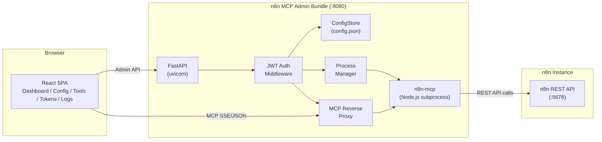
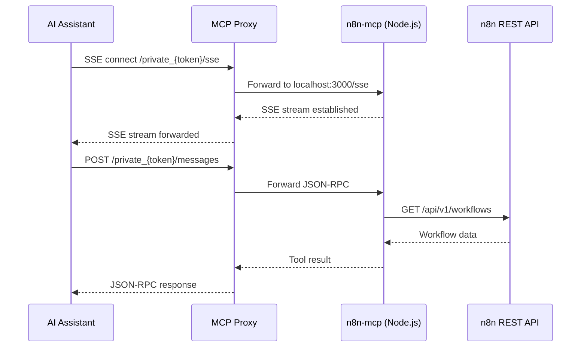
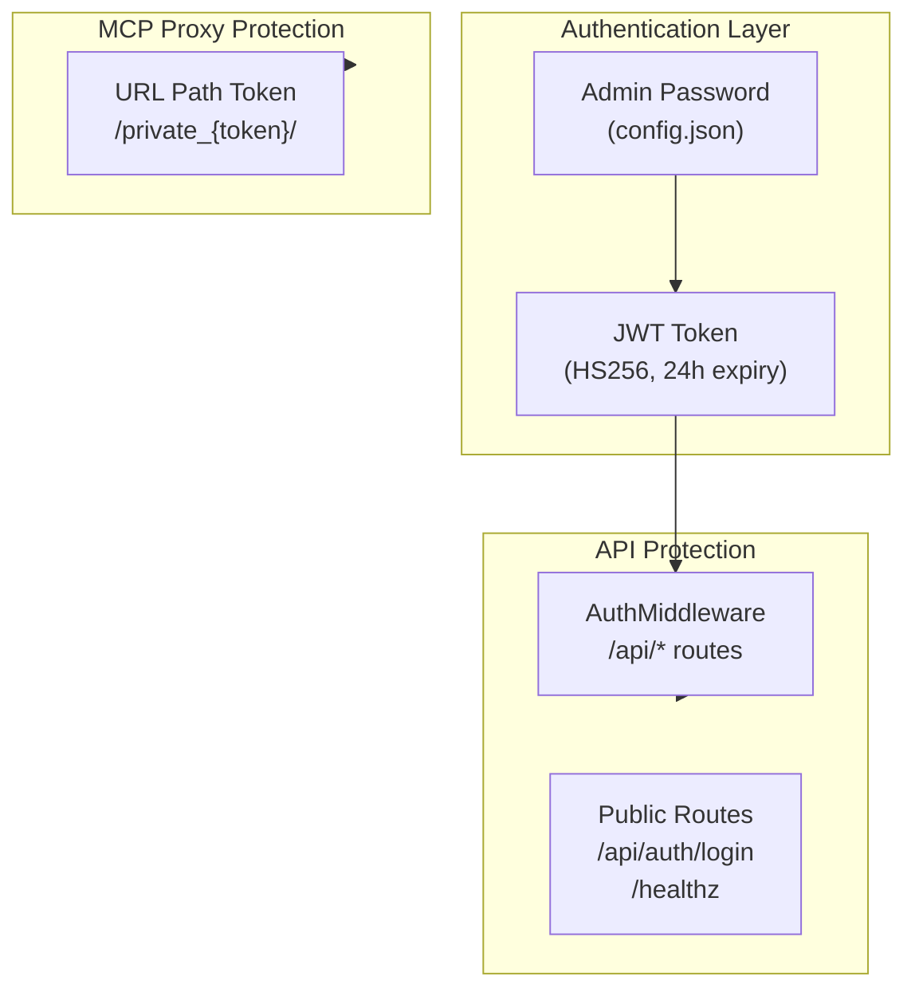

# Architecture

## System Overview

The n8n MCP Admin Bundle is a single-container solution that packages three components into one deployment unit:

1. **React SPA** (Frontend) -- Admin dashboard for managing n8n MCP server configuration
2. **FastAPI Backend** -- REST API + MCP reverse proxy + process manager
3. **n8n-mcp Server** (Node.js subprocess) -- MCP protocol server that interfaces with the n8n REST API

## Request Flow



## Component Details

### Frontend (React 19 + Tailwind CSS)

The frontend is a single-page application built with React 19, Tailwind CSS, and Vite. It provides seven views:

| Page | Description |
|------|-------------|
| Login | JWT-based authentication |
| Dashboard | System health overview (n8n, MCP server, proxy status) |
| Connection Config | n8n API URL and API Key configuration |
| Tool Manager | Enable/disable 24 MCP tools across 3 categories |
| Token Manager | MCP proxy token generation, rotation, and history |
| Log Viewer | Real-time SSE log streaming with search |
| Settings | Full config.json editor with MCP process control |

### Backend (FastAPI + Python 3.12)

The backend is split into two Python packages:

**mcp-admin-core** -- Shared library providing:
- `ConfigStore` -- File-backed JSON configuration persistence
- `McpProcessManager` -- asyncio subprocess lifecycle management
- `MCP Reverse Proxy` -- Token-validated reverse proxy with SSE streaming support
- `AuthMiddleware` -- JWT authentication for API endpoints
- `Settings Router` -- Full configuration CRUD

**n8n-mcp-admin** -- n8n-specific extension providing:
- `Connection Config Router` -- n8n API URL + API Key management with connectivity testing
- `Tool Manager Router` -- 24-tool registry with category-based enable/disable
- `Token Router` -- Proxy token generation, rotation, and history tracking
- `Health Router` -- Dashboard data aggregation (n8n version, workflow count, process status)
- `Log Router` -- In-memory ring buffer + SSE streaming

### n8n-mcp Server (Node.js)

The n8n-mcp server (`n8n-mcp` npm package, v2.60.0) is a Node.js process managed by `McpProcessManager`. It:

- Runs as a subprocess via `node http-server.js`
- Connects to the n8n REST API using the configured API URL and API Key
- Exposes 24 MCP tools for AI assistants (Claude, ChatGPT, etc.)
- Communicates via MCP protocol (SSE + JSON-RPC)

## Data Flow



## Configuration Architecture

All configuration is stored in a single JSON file (`/data/config.json`):

```json
{
  "admin_password": "...",
  "mcp_auth_token": "...",
  "connection": {
    "n8n_api_url": "http://n8n:5678",
    "n8n_api_key": "..."
  },
  "tools": {
    "disabled": [],
    "disabled_operations": {}
  },
  "mcp_server": {
    "command": "n8n-mcp",
    "args": ["--transport", "http", "--port", "3000"],
    "port": 3000,
    "env": {}
  },
  "proxy": {
    "timeout": 86400
  },
  "token_history": []
}
```

## Deployment Options

### Standalone (Podman/Docker)

Single container with a volume mount for persistent configuration:

```
podman run -p 8080:8080 -v ./data:/data ghcr.io/woowtech/n8n-mcp-admin:latest
```

### Docker Compose

Full stack with PostgreSQL + n8n + MCP Admin Bundle:

```
docker compose up -d
```

### Kubernetes

Deploy as a Deployment with RBAC, health probes, and resource limits. See `k8s-deploy.yaml`.

## Security Model



- **Admin GUI:** Protected by JWT authentication. Login with admin password, receive a 24-hour token.
- **MCP Proxy:** Protected by URL path token. AI assistants use `/private_{token}/` paths to access the MCP server.
- **MCP Server:** Not directly exposed. Only accessible through the authenticated reverse proxy.
